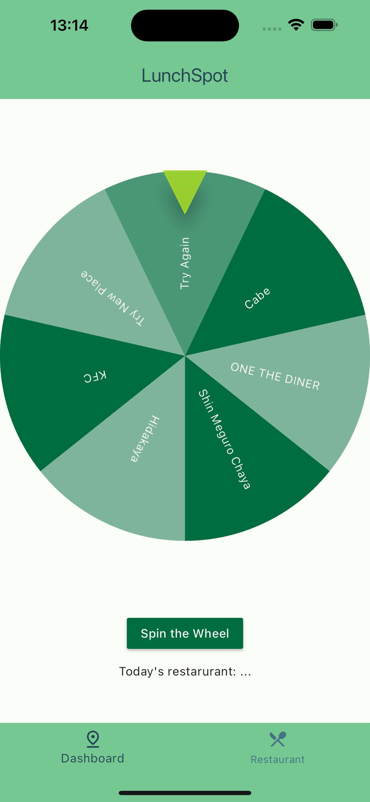

# Lunch Spot Suggestions App

This innovative app is designed to help you choose exciting places to eat based on your preferences and location. Our app provides personalized recommendations to make your lunch break a delightful experience.

**Motives to create this APP**

Choosing which restaurant to eat lunch at was a daily struggle. This app was created to obtain restaurant recommendations prior to lunch.

## Tech Stack:

- Flutter
- hive_flutter: Local database
- flutter_fortune_wheel: To select the restaurant name
- flutter_slidable: To delete the item

## Contribution:

We welcome contributions from the community! If you’d like to improve the Lunch Spot Suggestions App, please fork the repository and submit a pull request.

---

Feel free to customize this template to better fit the specifics of your application. Enjoy coding!
